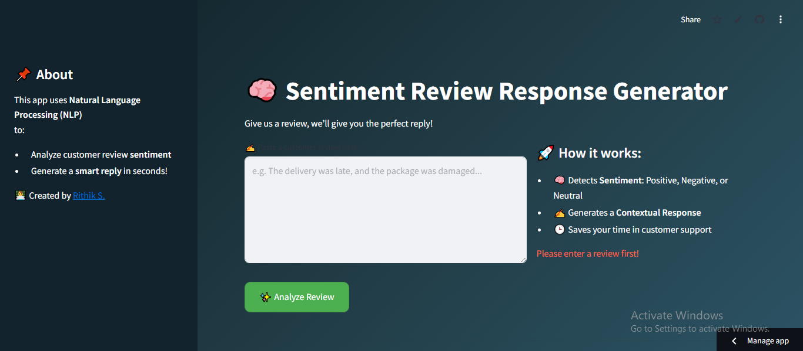

# 💬 Sentiment Review Response Generator

This project is an **AI-powered web app** that analyzes customer reviews, detects their **sentiment** (Positive, Negative, or Neutral), and generates a **smart, professional response** instantly — all using **Natural Language Processing (NLP)**.

🌐 **Live Demo**: [Try the App on Streamlit](https://sentiment-review-response.streamlit.app/)

---

## 🚀 Features

- 🧠 **Sentiment Analysis** using Hugging Face Transformers  
- ✍️ **Auto-Generated Replies** based on review sentiment  
- 📄 **Review Logging** – saves all interactions to a CSV file  
- 🎨 Beautiful, modern **Streamlit UI** with custom CSS styling  
- ⏱ Designed to save time and improve customer service workflows  

---



## 🛠️ Tech Stack

- **Python 3.9+**
- **Streamlit** – for frontend UI
- **Transformers (Hugging Face)** – for NLP & sentiment detection
- **Pandas** – for logging responses into CSV

---

## 📦 Installation

1. **Clone the repository**
```bash
git clone https://github.com/your-username/sentiment-review-response.git
cd sentiment-review-response
